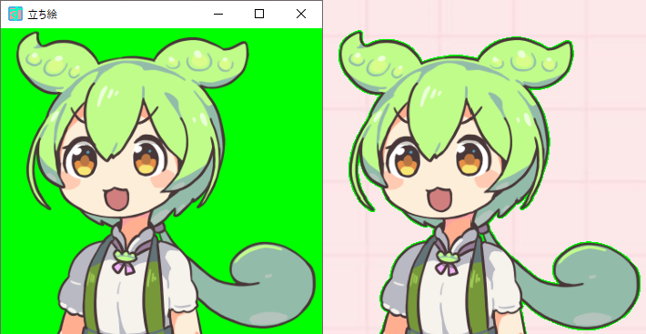

# ZundamonGPTonYouTube
English | [日本語](README2.md)<br><br>
Intelligent Zundamon replies YouTube chat with GPT brain.
<br><br>

## First of all
- This Application is Japanese only since it's depend on Japanese voice engine "VOICEVOX", but You can cutomize by modifying MIT liccenced source codes.

## This application works on
- Windows OS (tested on Windows 10)
- .Net Framework v.4 (tested on v4.7.2)
- the machine on which installed [VOICEVOX](https://voicevox.hiroshiba.jp/) (tested on v.0.14.6)

    Core Module is implemented by Python, so it can adapt to other OS or voice generators.
<br><br>

## This application can
- automatically pick up messages from YouTube chat and make Zundamon speak the GPT answer of those messages out. <br>
Thogh non Japanese messages are given, Zundamon answers in Japanese.
- display all comments of YouTube chat, picked up comments, answers of picked up comments.
- display Zundamon portrait with transparent background.
- You can use not only Zundamon voice and image but also other ones. <br>
[](https://www.youtube.com/embed/wpTGk_0Yf3M)

## Usage
- Install [VOICEVOX](https://voicevox.hiroshiba.jp/)
- Get OpenAI api-key. Please refer [here(English)](https://www.howtogeek.com/885918/how-to-get-an-openai-api-key/) or [here(Japanese)](https://laboratory.kazuuu.net/how-to-get-an-openai-api-key/)
- if you want to launch from .exe file.
    - click [here](https://github.com/GeneralYadoc/ZundamonGPTonYouTube/releases) to download newest version.
    - Unzip Downloaded "ZundamonGPTonYouTube.zip" file.
    - Open "ZundamonGPTonYouTube" and double click ZundamonGPTonYouTube.exe.
- if you want to launch from source codes.
    - Install ffmpeg.<br>
      <b>For Linux:</b> Execute following command.
      ```ffmpeg installation for Linux
      $ sudo apt-get install ffmpeg
      ```
  
      <b>For Windows:</b> Access [here](https://github.com/BtbN/FFmpeg-Builds/releases), download '*-win64-gpl.zip', extract the zip and move three exe files (ffmpeg.exe, ffprobe.exe, ffplay.exe) to the folder where you'll execute the sample or added path.<br>
      <br>
      <b>For Mac:</b> Access [here](https://brew.sh/), copy installation command to your terminal and push Enter key, and execute following command.
      ```
      brew install ffmpeg
      ```
    - Clone repository.<br>
        ```clone
        git clone https://github.com/GeneralYadoc/ZundamonGPTonYouTube.git
        ```
    - Move to ZundamonGPTonYouTube directory
        ```mv
        mv ZundamonGPTonYouTube.
        ```
    - Install the application.
        ```install
        pip install .
        ```
    - Start the application.
        ```
        python3 ZundamonGPTonYouTube.py
        ```
- Check Video ID of target YouTube stream.<br>
    
- Fill in the Video ID brank of start form. (use Ctrl+V to paste)
- Fill in the API Key (of OpenAI) brank of start form. (use Ctrl+V to paste)
- Click "すたーと" button which means "start".<br>
    

### Notice
- OpenAI api key and Video ID is recorded in "variable_cache.yaml" and You can skip either or both from the 2nd time.
- Please be aware of treating "variable_cache.yaml" in order to avoid leaking OpenAI api key.
<br><br>

## GUI is consisted of

### Main window
- You can change visibility of chat window by pressing "ちゃっと" button, asking window by pressing "しつもん" button, answering window by pressing "こたえ" button, portrait window by pressing "立ち絵" button.
- You can change voice volume by using slide bar which is at the bottom of the window.
- Also you can change voice volume by putting value on text box at the just right of the slide bar and press enter key. 
- You can exit the application by closing this window. window "x" button of TopRight.<br>
    

### Portrait window
- You can display a portrait of avatar which you like by specifying the path in setting file.
- You can switch opaque or transparent background by double clicking the avatar.
- You can resize the avatar in opaque background mode, please erase background after adjusting avatar size if you want.
- Minimizinq window also is available in opaque backgroune mode.<br>
- The Application keeps running even if this window is closed, so you can close this window if unnecessary.<br>
    

### YouTube chat monitor window
- Almost all messages are shown in this window.
- Messages contain only emoticons are ignored.
- Some messages which exist in polling gap may lost.
- You can switch visibility of window frame by double clicking message area of the window.
- Please turn on the frame when resizing the window.
- The Application keeps running even if this window is closed, so you can close this window if unnecessary.<br>
    

### Window for asking
- All picked up messages which will be answered by ChatAI are shown in this window.
- You can switch visibility of window frame by double clicking message area of the window.
- Please turn on the frame when resizing the window.
- The Application keeps running even if this window is closed, so you can close this window if unnecessary.<br>
    

### Window for answering
- ChatAI answers for picked up messages are shown in this window.
- You can switch visibility of window frame by double clicking message area of the window.
- Please turn on the frame when resizing the window.
- The Application keeps running even if this window is closed, so you can close this window if unnecessary.<br>
    <br>

### Notice
 - The following window is VOICEVOX which is external application.<br>
    It's necessary for generating Zundamon voices, so please don't close the window. (please minimize if you want to hide it.)<br>
    <br>
<br><br>

# Settings

You can customize the application with "setting.yaml" which is exist in the same layer of the application exe file.

```setting.yaml
# VoiceVoxの設定
voicevox_path: ''

# チャット欄ウィンドウの設定
display_user_name_on_chat_window: true
chat_window_title: 'ちゃっとらん'
chat_window_padx : 9
chat_window_pady : 9
chat_window_color: '#ffffff'
chat_font_color: '#000000'
chat_font_size: 10
chat_font_type: 'Courier'
chat_rendering_method: 'normal'

# 質問ウィンドウの設定
display_user_name_on_ask_window: false
ask_window_title: 'ぐみんのしつもん'
ask_window_padx : 9
ask_window_pady : 9
ask_window_color: '#354c87'
ask_font_color: '#ffe4fb'
ask_font_size: 12
ask_font_type: 'Courier'
ask_rendering_method: 'refresh'

# 回答ウィンドウの設定
answer_window_title: 'てんさいずんだもんのこたえ'
answer_window_padx : 9
answer_window_pady : 9
answer_window_color: '#ffe4e0'
answer_font_color: '#004cF7'
answer_font_size: 13
answer_font_type: 'Helvetica'
answer_rendering_method: 'incremental'

# 立ち絵ウインドウの設定
image_window_title: '立ち絵'
image_window_refresh_rate: 30
image_window_transparent_color: '#00ff00'
image_window_font_color: '#0000ff'
image_window_font_size: 11
image_window_font_type: 'Helvetica'
image_window_label: 'ダブルクリックで\n背景透過/非透過を\n切り替えられます'

# AIの設定
model: 'gpt-3.5-turbo'
max_tokens_per_request: 1024
ask_interval_sec: 20.0

# 回答キャラクターの設定
speaker_type: 1
volume: 100
system_role: 'あなたはユーザーとの会話を楽しく盛り上げるために存在する、日本語話者の愉快なアシスタントです。'
```

- "voicevox_path" can remain blank if VOICEVOX has been installed to default path.
- You can change AI model by changing "model" value.
- You can change voice actor by changing "speaker_type" value.
- You can change Avatar image by changing "image_file" path.

<br>
Current size and position, frame visibility, bagckground transparency of these windows is memorized and inherited to them in next time of executing.<br>
They are recorded in "variable_cache.yaml". you can change window size and position also by editing the file when the application is not running.

``` variable_cache.yaml
answer_frame_visible: false
answer_window_height: 450
answer_window_visible: true
answer_window_width: 500
answer_window_x: 659
answer_window_y: 521
api_key: XXXXXXXXXXXXXXXXXXXXXXXXXXXXXXXXXXXXXXXXXXX
ask_frame_visible: false
ask_window_height: 250
ask_window_visible: true
ask_window_width: 500
ask_window_x: 663
ask_window_y: 224
chat_frame_visible: false
chat_window_height: 754
chat_window_visible: true
chat_window_width: 350
chat_window_x: 246
chat_window_y: 225
image_bg_visible: false
image_window_height: 816
image_window_visible: true
image_window_width: 522
image_window_x: 1234
image_window_y: 175
video_id: XXXXXXXXXXX
```


<br><br>
# Licence
- The lisence type of this application is MIT, so you can customize freely.
- the lisence type of ffmeg executable files included in release package is LGPL.
<br><br>
# Links
- [Pixiv page of 坂本アヒル](https://www.pixiv.net/users/12147115) &emsp; I obtained static Zundamon portrait which is the material of the gif animation from here.
- [ChatAIStreamer](https://github.com/taizan-hokuto/pytchat) &emsp; Python library for getting ChatGPT voiced answer of YouTube chat stream.
