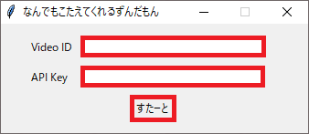

# ZundamonGPTonYouTube
Intelligent Zundamon replies YouTube chat with GPT brain.
<br><br>

## First of all
- This project is now Japanese only but I have a plan to open my source codes, then you'll be able to customize language.
- If you are not good at English, please use [Google Transrate](https://translate.google.com/?sjid=2238627840605957328-AP&sl=auto&op=websites)
<br><br>

## This application works on
- Windows OS (tested on Windows 10)
- .Net Framework v.4 (tested on v4.7.2)
- the machine on which installed [VOICEVOX](https://voicevox.hiroshiba.jp/) (tested on v.0.14.6)

Core Module is implemented by Python, so it can adapt to other OS or voice generators. Please wait for opening source codes. 
<br><br>

## This application can
- automatically pick up messages from YouTube chat and make Zundamon speak the GPT answer of those messages out. <br>
Thogh non Japanese messages are given, Zundamon answers in Japanese.
- display all comments of YouTube chat, picked up comments, answers of picked up comments.
- display Zundamon portrait with transparent background.<br>


## Usage
- Install [VOICEVOX](https://voicevox.hiroshiba.jp/)
- Get OpenAI api-key. Please refer [here(English)](https://www.howtogeek.com/885918/how-to-get-an-openai-api-key/) or [here(Japanese)](https://laboratory.kazuuu.net/how-to-get-an-openai-api-key/)
- Access [here](Release/ZundamonGPTonYouTube.zip) and click "Raw" button. You can download "ZundamonGPTonYouTube.zip" by the process.<br>
    
- Unzip Downloaded "ZundamonGPTonYouTube.zip" file.
- Open "ZundamonGPTonYouTube" and double click ZundamonGPTonYouTube_SampleUI.exe.
- Check Video ID of target YouTube stream.<br>
    
- Fill in the Video ID brank of start form. (use Ctrl+V to paste)
- Fill in the API Key (of OpenAI) brank of start form. (use Ctrl+V to paste)
- Click "すたーと" button which means "start".<br>
    

### Notice
- OpenAI api-key and Video ID is recorded in "variable_cache.yaml" and You can skip either or both from the 2nd time.
- Please be aware of treating "variable_cache.yaml" in order to avoid leaking OpenAI api-key.
<br><br>

## GUI is consisted of

### Zundamon portrait window (main window)
- You can swich opaque or transparent background by double clicking Zundamon.
- You can resize Zundamon in opaque background mode, please elase background after adjusting Zundamon size if you want.
- Minimizinq window also is available in opaque backgroune mode.
- You can exit the application by closing this window. window "x" button of TopRight also is enable in opaque background mode. <br>
    

### YouTube chat monitor window
- Almost all messages are shown in this window.
- Messages contain only stamps are ignored.
- Some messages which exist in 1msec polling gap may lost.
- The Application keeps running even if this window is closed, so you can close this window if unnecessary.<br>
    

### Window for asking
- All picked up messages which will be answered by Zundamon are shown in this window.
- The Application keeps running even if this window is closed, so you can close this window if unnecessary.<br>
    

### Window for answering
- Zundamon answers for picked up messages are shown in this window.
- The Application keeps running even if this window is closed, so you can close this window if unnecessary.<br>
    <br>

### Notice
 - The following window is VOICEVOX which is external application.<br>
    It's necessary for generating Zundamon voices, so please don't close the window.<br>
    <br>


<br><br>

# Settings

You can customize the application with "setting.yaml" which is exist in the same layer of the application exe file.
```setting.yaml
# VoiceVoxの設定
voicevox_path: ''

# チャット欄ウインドウの設定
monitor_window_visible: 'True'    # 'True' or 'False'
display_user_name_on_monitor_window: 'False'    # 'True' or 'False'
monitor_window_title: 'ちゃっとらん'
monitor_window_size: '350x754'
monitor_window_color: '#ffffff'
monitor_font_color: '#000000'
monitor_font_size: '10'
monitor_font_type: 'Courier'

# 質問ウインドウの設定
display_user_name_on_ask_window: 'False'    # 'True' or 'False'
ask_window_title: 'ぐみんのしつもん'
ask_window_size: '500x250'
ask_window_color: '#354c87'
ask_font_color: '#ffe4fb'
ask_font_size: '12'
ask_font_type: 'Courier'

# 回答ウインドウの設定
answer_window_title: 'てんさいずんだもんのこたえ'
answer_window_size: '500x450'
answer_window_color: '#ffe4e0'
answer_font_color: '#004cF7'
answer_font_size: '13'
answer_font_type: 'Helvetica'
volume: 100    # 0 - 1000
model: 'gpt-3.5-turbo'
max_tokens_per_request: 256
ask_interval_sec: 5.0
```

- voicevox_path can remain blank if VOICEVOX has been installed to default path.
- You can change AI model by modifying "model" value.
<br><br>

# Links
- [Pixiv page of 坂本アヒル](https://www.pixiv.net/users/12147115) &emsp; I obtained Zundamon portrait from here.
- [pytchat](https://github.com/taizan-hokuto/pytchat) &emsp; Python library for fetching youtube live chat.
